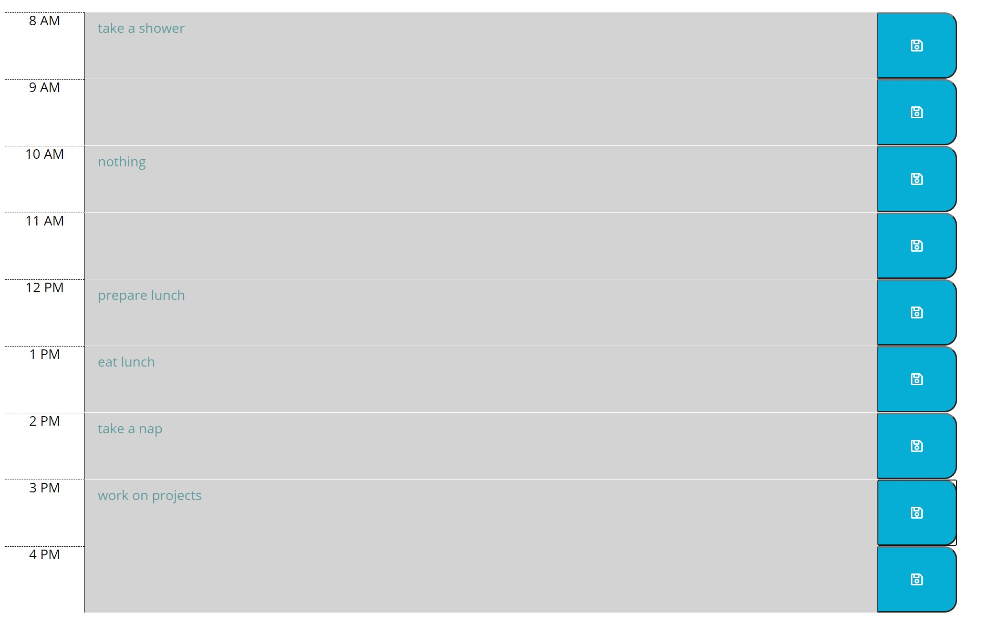
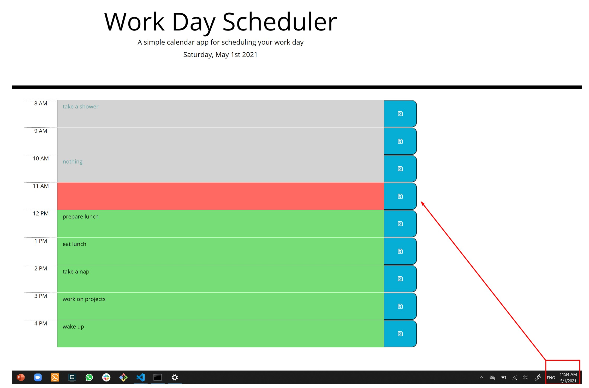
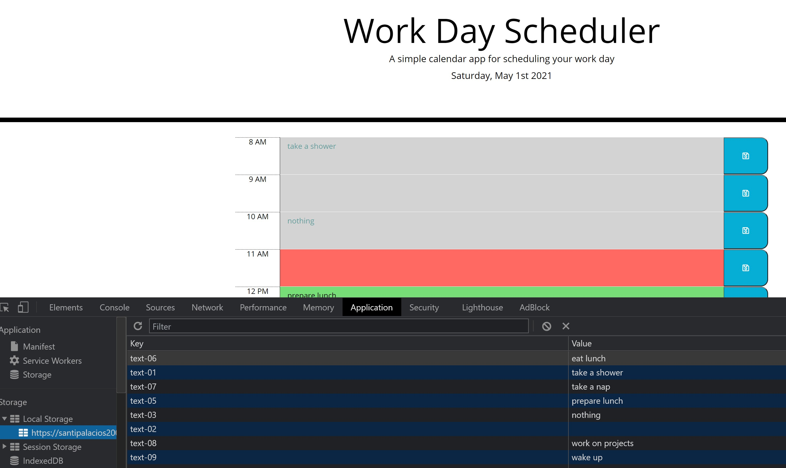

# Third Party APIs: Work Day Scheduler

## Homework-5: Day Planner

The purpose of this assignment is to create a simple calendar application that allows a user to save events for each hour of the day by modifying starter code. This app will run in the browser and feature dynamically updated HTML and CSS powered by jQuery. 

You can review the current day planner application by going to the following url: https://santipalacios2002.github.io/day-planner/


<br />

# Acceptance criteria
## :heavy_check_mark: Current day displayed

Current date is displayed by using moment.js

```js
$("#currentDay").text(moment().format("dddd, MMMM Do YYYY"));                           //adds the current date in day, month, date, year format
```

<br />

## :heavy_check_mark: timeblocks with standard business hours

The user is presented with timeblocks for standard business hours 



<br />

## :heavy_check_mark: Color representing past, present future

Timeblocks are color coded to indicate whether it is in the past, present, or future



<br />

## :heavy_check_mark: Event storage

User can enter an event and when clicked the save button for that timeblock then the text for that event is saved in local storage 




